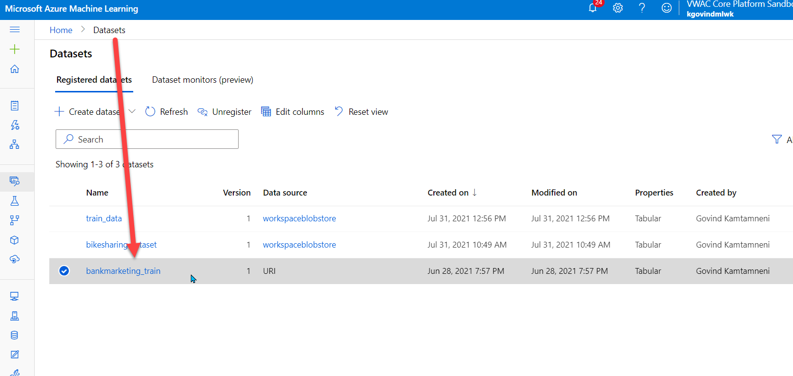

# Udacity Nanodegree Project 2 - Operationalizing Machine Learning

Using Azure Machine Learning, this project configures a cloud-based machine learning production model, deploys it, and consumes it. In addition, this project also creates, publishes, and consumes a pipeline

## Architectural Diagram
In this project, I leveraged existing [Bank Marketing dataset](https://www.kaggle.com/henriqueyamahata/bank-marketing), which tries to predict whether a customer will deposit money or not. I then create a AutoML step, which is in turn part of a pipeline step. After I run this pipeline, it generates the best model identified via AutoML, which I then deployed to ACI with authentication. This model endpoint is then invoked via the auth token, which demonstrates consumption of the model. In addition, I enabled application insights so that I can monitor and observe the model in runtime. 

## Key Steps
1. Authentication - Installed az ml, created service principal and shared the wksp with sp (not using the lab's, instead, have a subscription from work that I'm using):

1b. The service principal created in the above step is shown as the owner of this workspace:

2. AutoMl - created AutoML exp and ran the classification based exp in a NC compute cluster. The screenshot below shows the dataset being loaded as part of the experiment.

2b. The dataset shown from the datasets tab after the pipeline run:

2c. The below images shows the completion of the pipeline

2d. The best model from the above pipeline run is retrieved below:

3. Deployed the model using ACI and enabled authentication as shown below

4. Enabled application insights using `logs.py` 

Below is a screenshot of executing `logs.py` to enable application insights and to display the logs:

5. Load the swagger.json of model using the provided swagger client script:

6. Executed `endpoint.py` to consume the model endpoint with test data and benchmarked.
The execution result of `endpoint.py` with the given test inputs:

The execution of `ab` utility to benchmark

7. Created and published the pipeline using the Jupyter Notebook from starter files:

PipelineRun details from within the notebook:

Same PipelineRun from above notebook view can also be seen from the portal perspective in a different view:

## Screen Recording
[https://www.screencast.com/t/mbY4yZN7f8M7](https://www.screencast.com/t/mbY4yZN7f8M7)

- updated: [https://www.screencast.com/t/wDA3WX7KKY](https://www.screencast.com/t/wDA3WX7KKY)

## Standout Suggestions
In the future, we could have the flexibility to load the swagger.json in Postman or other swagger clients rather than run the provided script as it had it's own challenges, which is unecessary to highlight the point of this task - operationalizing a ml pipeline. 
